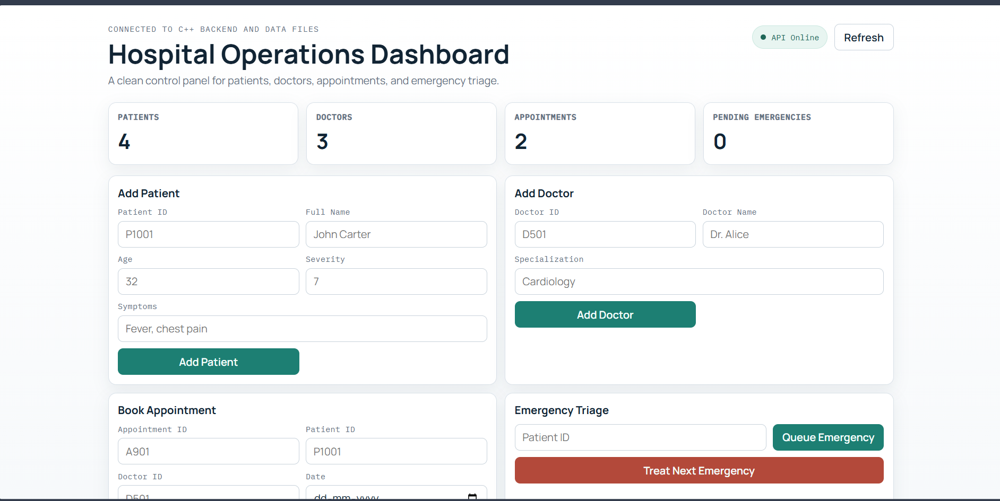

# 🏥 Hospital Management System

A **high-performance Hospital Management System (HMS)** built in **C++17**, designed with a strong focus on **Data Structures and Algorithms (DAA)** and clean **Object-Oriented Programming (OOP)** principles.

This system supports both:

* 🖥️ **CLI-based interaction**
* 🌐 **Web API + Frontend dashboard**

All layers operate on the same **core logic and persistent data**, ensuring consistency and modularity.




---

## 🚀 Key Features

* 👤 Patient Management (Add, Search, View)
* 👨‍⚕️ Doctor Management with specialization indexing
* 📅 Appointment Booking with validation
* ⏱️ Sorted appointment listing (date/time)
* 🚑 Emergency Triage (priority-based)
* 💾 Automatic file-based persistence
* 🔗 Unified CLI + Web interface over same system
* ⚡ Efficient performance using optimized DSA choices

---

## 🧠 System Design Philosophy

This project is designed around **real-world efficiency**:

> “Operations should remain fast and predictable even as data grows.”

Instead of using heavy databases or frameworks, this system leverages:

* **Optimized in-memory structures**
* **File-based persistence**
* **Algorithm-driven decision making**

---

## 🧩 Architecture Overview

```text
                ┌─────────────────────┐
                │     Frontend UI     │
                │ (HTML + JS Client)  │
                └─────────┬───────────┘
                          │ REST API
                ┌─────────▼───────────┐
                │   Web API Layer     │
                │   (C++ HTTP Server) │
                └─────────┬───────────┘
                          │
                ┌─────────▼───────────┐
                │  Core HMS Engine    │
                │ (OOP + DSA Logic)   │
                └─────────┬───────────┘
                          │
                ┌─────────▼───────────┐
                │ File Persistence    │
                │   (data/*.txt)      │
                └─────────────────────┘
```

---

## 🧠 DAA Approaches Used (What & Why)

This project uses **practical and production-relevant DSA techniques** to optimize common hospital workflows.

### 🔹 1. Hash Map (`unordered_map`)

* **Used in:** `patientsById_`, `doctorsById_`
* **Purpose:** O(1) average lookup for entities
* **Why:** Fast retrieval is critical in healthcare systems

---

### 🔹 2. Hash Set (`unordered_set`)

* **Used in:** `appointmentIds_`
* **Purpose:** Enforces unique appointment IDs
* **Why:** Prevents data inconsistency efficiently

---

### 🔹 3. Binary Search (`lower_bound`)

* **Used in:** Patient name search
* **Purpose:** O(log n) search performance
* **Why:** Faster than linear scan for large datasets

---

### 🔹 4. Sorted Index Maintenance

* **Used in:** `patientNameIndex_`
* **Purpose:** Maintain sorted structure for binary search
* **Complexity:** O(n) insert, O(log n) search

---

### 🔹 5. Sorting (`std::sort`)

* **Used in:** Appointment and doctor listings
* **Purpose:** Ordered output (time-based / ID-based)
* **Complexity:** O(n log n)

---

### 🔹 6. Priority Queue (`std::priority_queue`)

* **Used in:** `emergencyQueue_`
* **Purpose:** Always treat highest severity first
* **Complexity:** O(log n) insert/remove

---

### 🔹 7. Greedy Strategy (Emergency Handling)

* **Used in:** Emergency triage system
* **Purpose:** Always process the most critical case
* **Why:** Mirrors real-world hospital triage logic

---

## 💾 File Handling (Persistence)

The system ensures **data durability without a database**.

### 📂 Storage Structure

* `data/patients.txt`
* `data/doctors.txt`
* `data/appointments.txt`
* `data/emergency_queue.txt`

### ⚙️ Behavior

* Loads all data at startup
* Saves immediately after each mutation
* Automatically creates `data/` folder if missing

### 🛡️ Design Benefit

* Lightweight
* Easy to debug
* No external dependencies

---

## 🖥️ Build & Run

### 🟢 Windows (PowerShell + MinGW)

```powershell
cmake -S . -B build-mingw -G "MinGW Makefiles" -DCMAKE_CXX_COMPILER=g++
cmake --build build-mingw
.\build-mingw\hms.exe
```

---

### 🌐 Run Web Server

```powershell
cmake --build build-mingw --target hms_web
.\build-mingw\hms_web.exe
```

Open in browser:

```
http://localhost:8080
```

---

### 🐧 Linux / macOS

```bash
cmake -S . -B build
cmake --build build
./build/hms
```

---

### ⚡ Direct Compile (Optional)

```bash
g++ -std=c++17 -O2 src/main.cpp src/hospital_system.cpp -o hms
./hms
```

---

## 🌐 Frontend Integration

* Served from: `frontend/`
* API Base URL: `http://127.0.0.1:8080/api`
* Works with:

  * Local server
  * VS Code Live Preview

---

## 📌 Why This Project Stands Out

✔ Combines **OOP + DSA + System Design**
✔ Uses **real-world triage logic**
✔ Demonstrates **performance-aware design**
✔ Supports both **CLI and Web interface**
✔ Clean, modular, and extensible

---

## 📈 Future Improvements

* Database integration (PostgreSQL / SQLite)
* Real-time updates (WebSockets)
* Authentication system
* Advanced analytics dashboard
* Graph-based ambulance routing (Dijkstra)

---

## 🎯 Resume Highlight

> Developed a Hospital Management System in C++ using OOP and advanced DSA techniques (hash maps, priority queues, binary search) with both CLI and web interfaces, ensuring efficient patient management and emergency triage.

---

## ❓ FAQs

### Q: Why not use a database?

A: For this project scope, file-based persistence keeps the system simple, portable, and easy to debug while still demonstrating core logic.

---

### Q: Why use `priority_queue`?

A: To ensure emergency cases are handled based on severity, matching real-world hospital triage.

---

### Q: How scalable is this system?

A: The in-memory + file approach works well for small to medium datasets. For larger systems, it can be extended with databases and distributed services.

---

### Q: Why use DAA in HMS?

A: Hospital systems require fast lookup, prioritization, and sorting — DSA ensures these operations remain efficient as data grows.

---

## 🧠 Final Note

This project is designed to demonstrate **strong fundamentals in systems programming, algorithmic thinking, and practical software engineering**, making it suitable for both academic evaluation and technical interviews.

---

